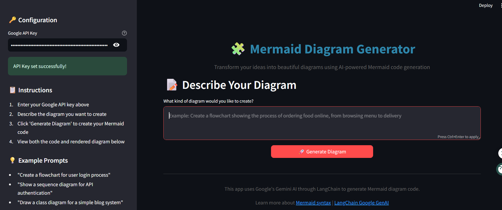
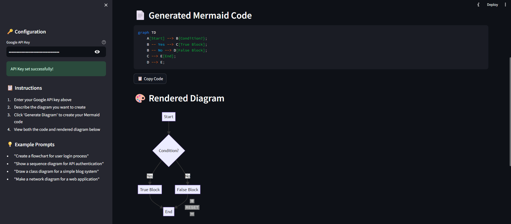

# DiagramGPT 🧩

**Transform your ideas into beautiful diagrams using AI-powered Mermaid code generation**

DiagramGPT is an intelligent web application that converts natural language descriptions into professional Mermaid diagrams. Simply describe what you want to visualize, and our AI will generate the corresponding Mermaid code and render it as a beautiful, interactive diagram.





## ✨ Features

- **AI-Powered Generation**: Uses Google's Gemini model through LangChain to understand your requirements and generate accurate Mermaid code
- **Real-time Rendering**: Instantly visualizes your generated diagrams using Mermaid.js
- **User-Friendly Interface**: Clean, intuitive Streamlit interface with helpful prompts and examples
- **Multiple Diagram Types**: Supports flowcharts, sequence diagrams, class diagrams, network diagrams, and more
- **Code Export**: View and copy the generated Mermaid code for use in your own projects
- **Responsive Design**: Works seamlessly across different screen sizes

## 🚀 Getting Started

### Prerequisites

Before running DiagramGPT, make sure you have the following installed:

- Python 3.11 or higher
- pip (Python package installer)
- A Google API key (free from Google AI Studio)

### Installation

1. **Clone the repository**
   ```bash
   git clone https://github.com/raunakgola/DiagramGPT.git
   cd DiagramGPT
   ```

2. **Install required dependencies**
   ```bash
   pip install -r requirements.txt
   ```

3. **Set up your Google API key**
   - Visit [Google AI Studio](https://makersuite.google.com/app/apikey)
   - Create a free API key
   - You can either:
     - Set it as an environment variable: `export GOOGLE_API_KEY=your_api_key_here`
     - Or enter it directly in the application's sidebar

4. **Run the application**
   ```bash
   streamlit run app.py
   ```

5. **Open your browser**
   Navigate to `http://localhost:8501` to start using DiagramGPT

## 📋 Required Dependencies

Create a `requirements.txt` file with the following packages:

```
streamlit==1.28.0
langchain==0.3.26
langchain-community==0.3.27
langchain-core==0.3.68
langchain-google-genai==2.1.7
streamlit-mermaid==0.3.0
```

## 🎯 How to Use

1. **Enter Your API Key**: In the sidebar, paste your Google API key to enable AI generation
2. **Describe Your Diagram**: Write a natural language description of what you want to visualize
3. **Generate**: Click the "Generate Diagram" button to create your Mermaid code
4. **View Results**: See both the generated code and the rendered diagram
5. **Copy and Use**: Copy the Mermaid code for use in your documentation, presentations, or projects

### Example Prompts

Here are some example prompts to get you started:

- **Flowchart**: "Create a flowchart for user login process with validation steps"
- **Sequence Diagram**: "Show a sequence diagram for API authentication between client, server, and database"
- **Class Diagram**: "Draw a class diagram for a simple blog system with users, posts, and comments"
- **Network Diagram**: "Make a network diagram for a web application with load balancer, web servers, and database"

## 🏗️ Technical Architecture

DiagramGPT is built using several key technologies that work together seamlessly:

### Core Components

- **Streamlit**: Provides the web interface and handles user interactions
- **LangChain**: Manages the connection to Google's AI models and prompt engineering
- **Google Generative AI**: Powers the intelligent diagram generation using Gemini models
- **Mermaid.js**: Renders the generated diagrams in the browser
- **streamlit-mermaid**: Integrates Mermaid.js with Streamlit for seamless diagram display

### How It Works

1. **User Input Processing**: The application takes your natural language description and processes it through a carefully crafted prompt template
2. **AI Generation**: LangChain sends the formatted prompt to Google's Gemini model, which generates appropriate Mermaid code
3. **Code Extraction**: The response is cleaned and formatted to ensure valid Mermaid syntax
4. **Diagram Rendering**: The generated code is rendered using Mermaid.js to create an interactive diagram
5. **User Experience**: Both the code and diagram are displayed, allowing users to understand and reuse the generated content

## 🔧 Configuration

### Environment Variables

- `GOOGLE_API_KEY`: Your Google API key (required for AI generation)

### Model Settings

The application uses the following default settings for optimal diagram generation:

- **Model**: `gemini-1.5-flash` (fast and efficient for code generation)
- **Temperature**: `0.3` (balanced creativity with consistency)

## 🎨 Supported Diagram Types

DiagramGPT can generate various types of Mermaid diagrams:

- **Flowcharts**: Process flows, decision trees, workflow diagrams
- **Sequence Diagrams**: API interactions, communication flows, time-based processes
- **Class Diagrams**: Object-oriented design, database schemas, system architecture
- **State Diagrams**: Application states, user journeys, system behaviors
- **Network Diagrams**: System architecture, infrastructure layouts

## 🛠️ Customization

### Modifying the Prompt Template

You can customize how the AI generates diagrams by modifying the `create_mermaid_prompt()` function. The prompt template guides the AI's behavior and output format.

### Styling and Appearance

The application uses custom CSS for styling. You can modify the appearance by updating the CSS in the `st.markdown()` section at the top of the file.

### Adding New Features

The modular structure makes it easy to add new features:

- **Additional AI Models**: Modify the `initialize_llm()` function to support other providers
- **Export Options**: Add functions to export diagrams as PNG, SVG, or PDF
- **Diagram Templates**: Create pre-built templates for common diagram types

## 🤝 Contributing

We welcome contributions to DiagramGPT! Here's how you can help:

1. **Fork the repository**
2. **Create a feature branch**: `git checkout -b feature/amazing-feature`
3. **Make your changes**: Implement your feature or fix
4. **Test thoroughly**: Ensure your changes work correctly
5. **Commit your changes**: `git commit -m 'Add amazing feature'`
6. **Push to the branch**: `git push origin feature/amazing-feature`
7. **Open a Pull Request**: Describe your changes and their benefits

## 📝 License

This project is licensed under the MIT License - see the [LICENSE](LICENSE) file for details.

## 🙏 Acknowledgments

- **Google AI**: For providing the powerful Gemini models
- **LangChain**: For the excellent AI integration framework
- **Mermaid.js**: For the beautiful diagram rendering capabilities
- **Streamlit**: For making web app development accessible and enjoyable

## 📞 Support

If you encounter any issues or have questions:

1. **Check the Issues**: Look through existing GitHub issues for solutions
2. **Create a New Issue**: If you find a bug or have a feature request
3. **Documentation**: Refer to the official documentation of the underlying 
technologies

**NOTE:** There is some issue creating complex diagrams as it make mistake whike creating it maybe in future i will fix this by using pretrained models that generate mermaid code or fine tune the model 

## 🚀 Future Enhancements

We're continuously working to improve DiagramGPT. Upcoming features include:

- **Multiple AI Providers**: Support for OpenAI, Anthropic, and other AI models
- **Diagram Templates**: Pre-built templates for common use cases
- **Export Options**: Direct export to PNG, SVG, and PDF formats
- **Collaboration Features**: Share and collaborate on diagrams
- **Advanced Customization**: More styling and formatting options

---

**Ready to transform your ideas into diagrams? Start using DiagramGPT today!** 🎉
